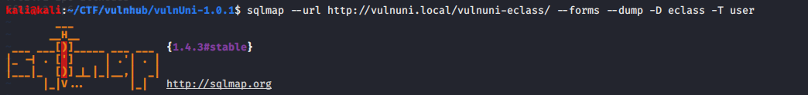
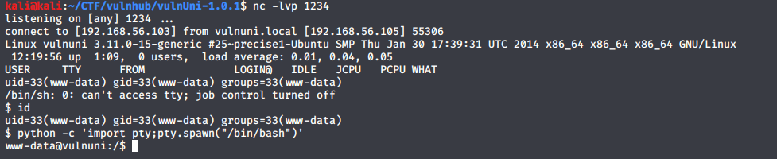

# VulnUni: 1.0.1 - vulnHub

[VulnUni:1.0.1 VulnHub link](https://www.vulnhub.com/entry/vulnuni-101,439/)

## arp scan to find out our machine ip address on the network


we found out our target ip address is 192.168.56.105

## Nmap
first we need to check what ports and services are available for us in the target machine using nmap tool:


**command exaplain:**

**nmap** - network scanner tool used to discover hosts and services on machines.

**-sC** - preforming script scan using default scripts.

**-sV** - preforming service version detection.

**-oA** - output in all formats.

it is recommanded to scan the machine at the background for all ports while enumerating the machine, becuase all ports scan found the same ports I wont show it.

from the nmap scan we discovered 1 port is open:

*port 80* - Apache httpd.

## Enumerating the website:

we visit the website available to us and investigating it (the pages available to us and their functionalities)


after some investigating mentioned above didn't found any hidden pages using gobuster and the buttons on the pages or submit buttons didn't work, so we investigate the source code on the site pages and we found in the courses page:

```html
      <div class="collapse navbar-collapse" id="ftco-nav">
	        <ul class="navbar-nav mr-auto">
	        	<li class="nav-item"><a href="index.html" class="nav-link pl-0">Home</a></li>
	        	<li class="nav-item"><a href="about.html" class="nav-link">About</a></li>
	        	<li class="nav-item active"><a href="courses.html" class="nav-link">Courses</a></li>
				<!-- Disabled till new version is installed -->
				<!-- <li class="nav-item"><a href="vulnuni-eclass-platform.html" class="nav-link">EClass Platform</a></li> -->
	        	<li class="nav-item"><a href="teacher.html" class="nav-link">Staff</a></li>
	        	<li class="nav-item"><a href="blog.html" class="nav-link">Blog</a></li>
	          <li class="nav-item"><a href="contact.html" class="nav-link">Contact</a></li>
	        </ul>
	      </div>
```

it's helpful to search in html source code some elements that are not visible in page by searching comments ( <!-- or --> ) or searching hidden elements by searching the word hidden.

## eClass 

so we browse to the link we found and press the login link that brings us to the following login page:


** we need to add vulnuni.local to the /etc/hosts with host ip for more smooth access, since all the links direct to this host name **

after trying the common username and passwords with no success we go to sqlmap tool.

first we scan for the existing databases:


**command explain:**

**sqlmap** - sql injection tool written in python.

**--url** - url of the target site.

**-forms** - target forms in the target url.

**--dbs** - enumerate the existing databases.

from the injection we get the following databases:


we want users credentials for the eClass page so we target eclass db.

now we scan for the exsiting tables in eclass database:


**command explain:**

**--tables** - enumerate the existing tables.

**-D** - specific database to enumerate.

from the injection we get the following tables:


probably the user credentials are stored in users table so we target this table for the data:



**command explain:**

**--dump** - dump the db tables entries.

**-T** - specific table to enumerate.

from the injection we get the following data:


and we get an admin credentials!

username: admin

password: ilikecats89

## Initial Shell:

after we got admin access we investigate the site and search for an existing exploit.

to get the platform version we simply visit the About the platform page:


if we search for eClass exploit with the above version, we found exploit from exploit-db  with multiple methods for version 1.7.3 that also vulnreable to older versions (EDB-ID: 48163)

we found one method that can get us a shell:


if we follow the above steps we get a shell:

set up a php reverse shell that can be found online with the attacker ip and port:


zip the php file and upload it to the site:


we need start a listener on the port 1234 using netcat:


**command explain:**

**nc** - netcat, tcp and udp tool for connections and listens.

**-l** - listen for connections.

**-v** - verbose output.

**-p** - port number.

now if we browse to the path /cources/tnpUnzipping/ and enter to the file we uploaded:


we got a shell!



let's get the user flag:


## root access:

first, we enumerate the system, searching for suid files, sensitive files and more but found nothing.

so we use an existing enumerating linux tool called LinEnum.

we transfer it to the tmp folder using python simpleHTTPServer and wget and run the file:


after reading the enumerated data from the output script found nothing interesting, so we go deeper, kernel exploit.

from LinEnum we got the following kernel information:


searching for a kernel exploit with the above version on google, found dirty cow exploit.

let's copy it to our machine using searchsploit:


send it to the target machine using the same method above we used for LinEnum.

let's compile the exploit and run it!


the compile command can be found on the exploit commants.

now we can get the root flag!


